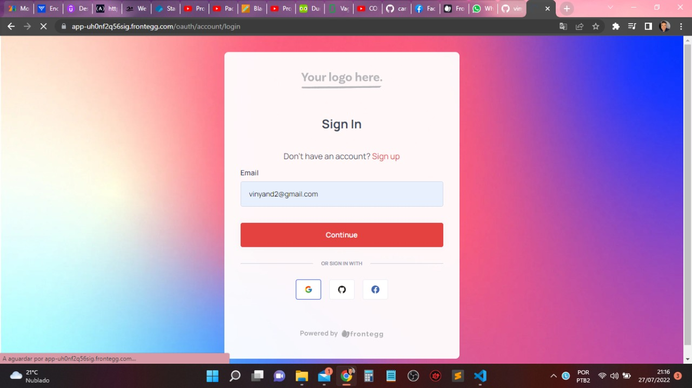

## Chat feito em react contendo login com autenticação (google, github e facebook.) 



### Para utilizar ou testar:

use node v18.3.0 ```nvm use v18.3.0```
frontend: ```npm install && npm start```
backend: ```npm install && npm start```


#### documentação frontegg.com
